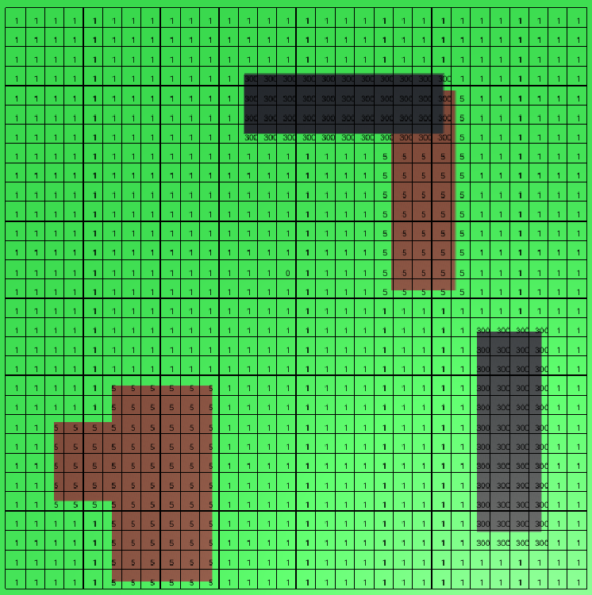
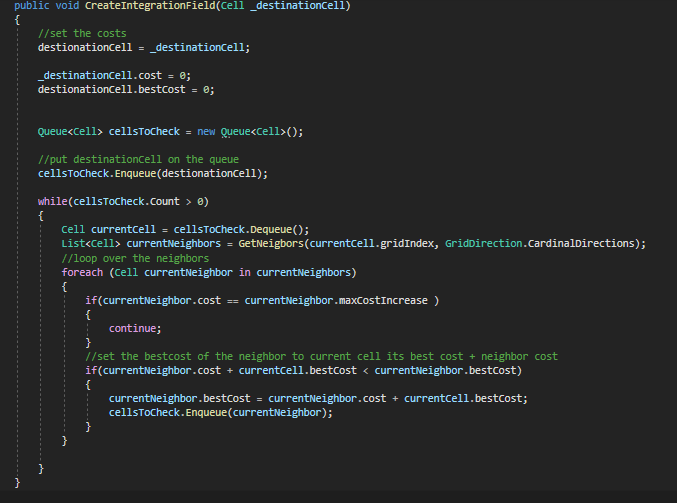
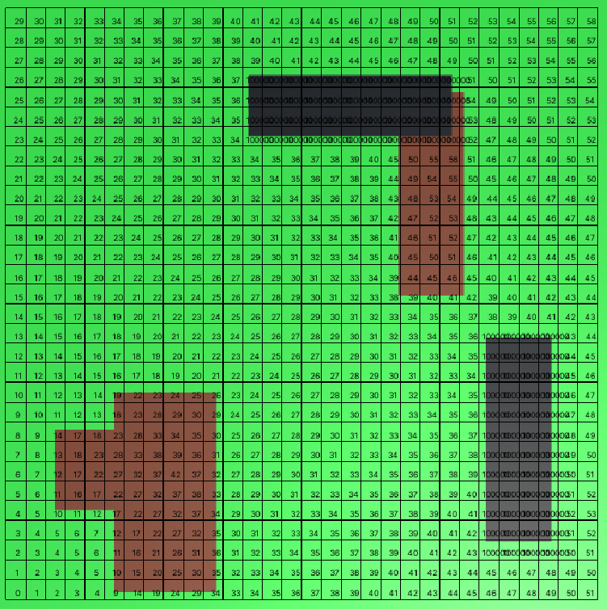
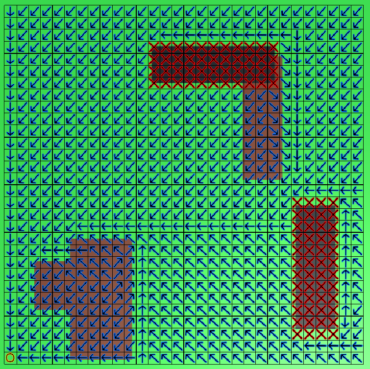

# Flowfields
Hi,
In this project i will research Flowfields.

What are Flowfields?

Flowfields, which you can also call vector fields is a technique to calculate the best path to a destination from somewhere in the world. The world is divided into a grid, every cell has their own vector. The vectors point towards their neighboring node, which gives the fastest path towards the goal. When an agent passes over a cell, it uses the vector inside that cell to influence its velocity. The agent traverses over every cell like this until it reaches the goal. 

How to create a flowfield?

I decided to create my implementation in unity. I made my setup by creating a simple ground(grass) plane, creating a 30x30 grid. I also implemented some visual debuginformation whilst working on the project. 

Creating a flowfield takes a couple of steps.
First of all you need to create a cost field. A cost field gives every cell a value between 1 and a maximum amount. My maximum amount was 300, but this can be any other large number. Every cell is set to a value of 1 by default. I created 2 terrain types, mud and walls and added some of these objects to my scene. I then went over each cell, upon colliding with one of these terrain types i increased their respective cell. I increased the cost of mud cells by 4, so they have a value of 5 and wall cells got a value of 300.

After this it is time to create the integration field. This is most of the calculations for the flowfield. It calculates the cost to travel from a cell in the world to the goal cell.
I used this algorithm and code:

1. The besCost of a cell is the lowest cost that it takes to get from that cell to the goal cell. By default every bestCost is set to a high value, i used 100000.
2. Set the destinationCel(the goal cell) cost and bestCost to 0 and add it to a queue.
3. While we still have cells to check, take the current cell, dequeu it and get its neighbors. 
4. For each (horizontal and vertical) neighbor, if their cost plus the currentcel its bestCost is lower than the neighbor its bestCost. Set the bestCost from the neighbor to this sum and add the neighbor back to the queue. If the neighborcost is equal to a wall(maxCostIncrease), it gets ignored. This causes the walls to stay at a bestCost of 100000, making them untraversable.
5. This repeats until the queue is empty.

I made my destination cell the botom left corner. The integration field then looks like this.

With the integration field setup, we can create our actual flowfield. I go through every cell in the grid and compare the bestCost from the cell to its neighbors, this time i do not only compare it with the vertical and horizontal neighbors, but also with the diagonal neighbors. When i find the neighbor with the lowest bestCost, i store a vector in the cell that points to that neighbor. If the neighboring cells are untraversable(because they are a wall), the cell gets a zero vector. 
In my project i use arrows to visualize the vectors and an X so show the cells with a wall. 

After that i implemented some agents. While they traverse a cell their velocity gets adjusted by the vector inside that cell until they reach the goal node. Every time i change the goal cell, the path gets recalculated. Resulting in this. 

https://user-images.githubusercontent.com/97398099/151199493-d12831b1-699c-4d5b-a47d-cecff0f78ada.mp4

And now without the debug visualisation to create the final result.

https://user-images.githubusercontent.com/97398099/151199881-e8858861-b219-46a7-8172-a6fa4489e708.mp4

